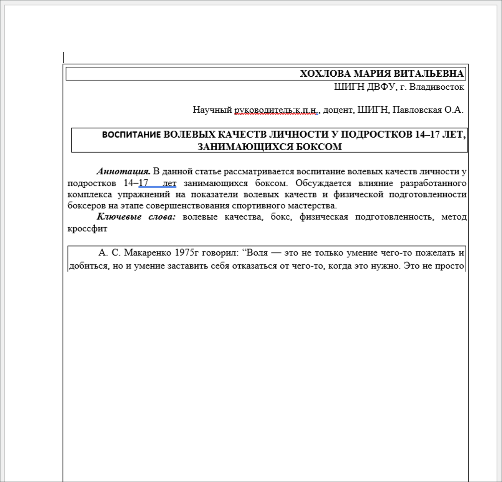
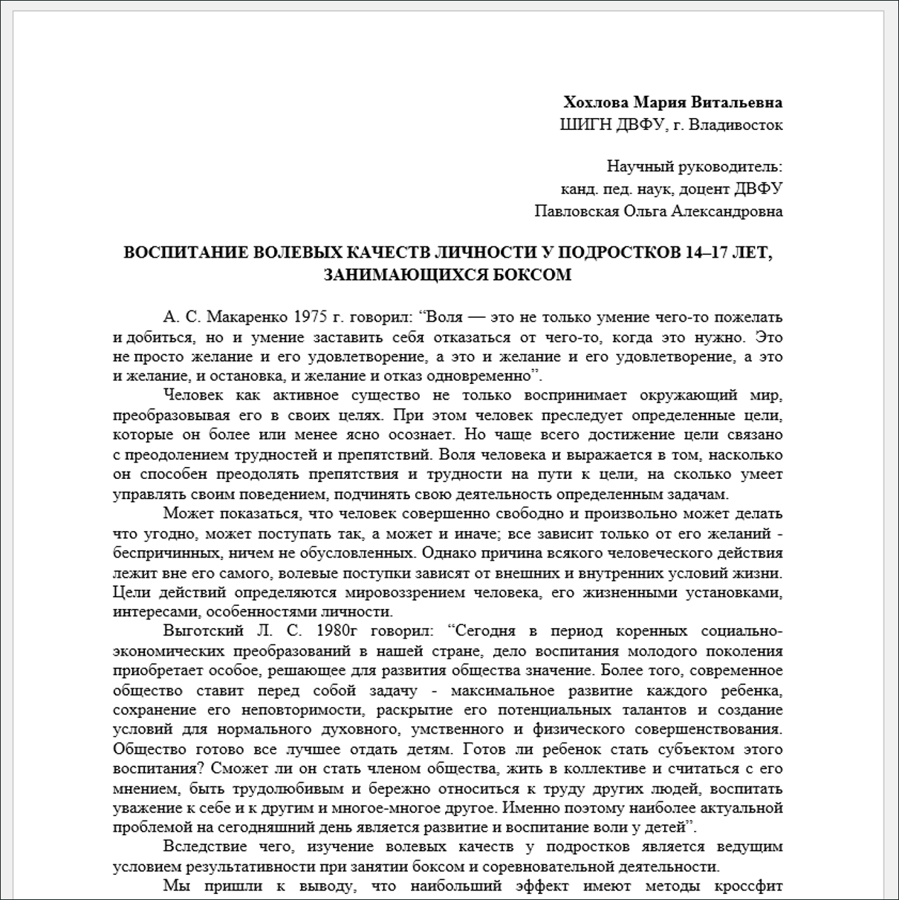
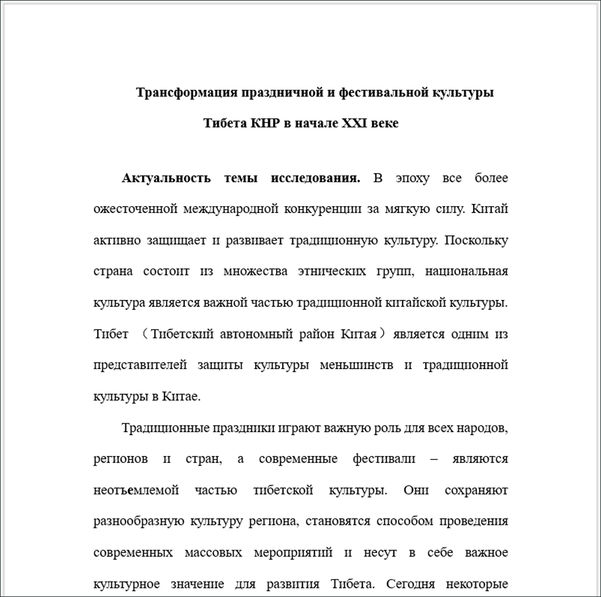
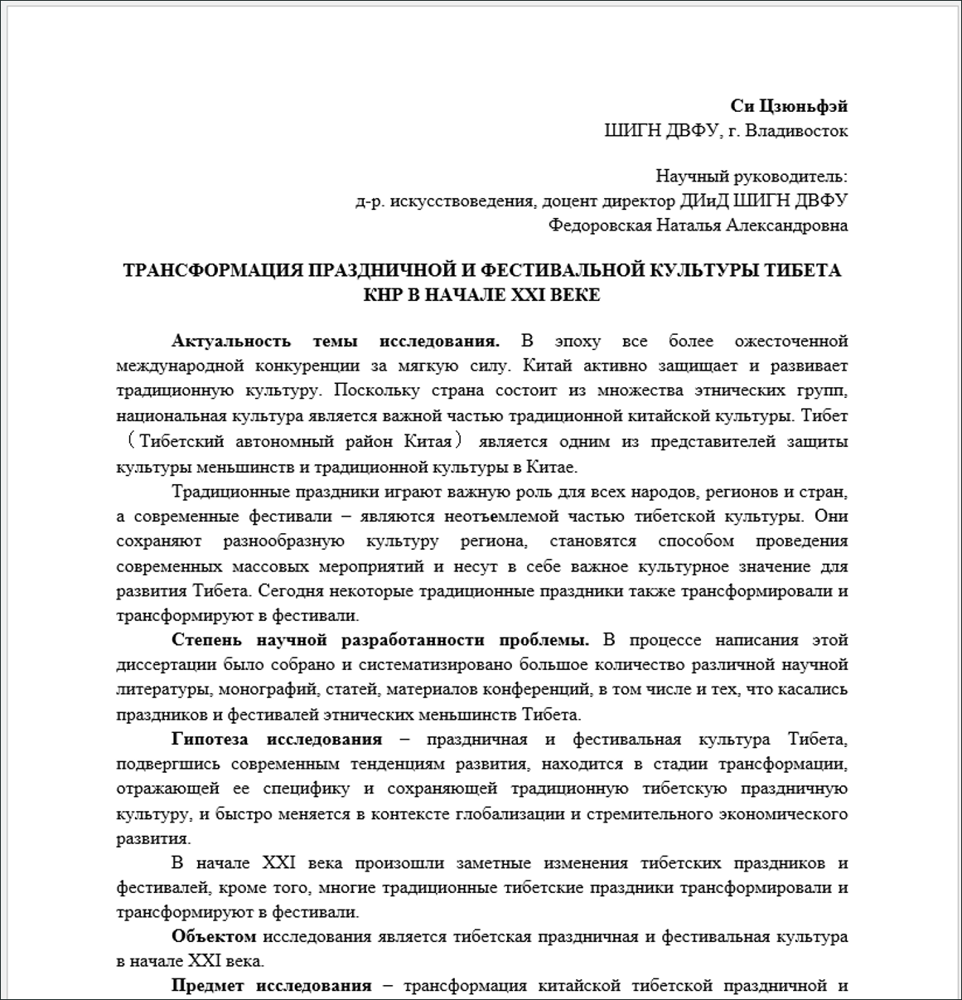
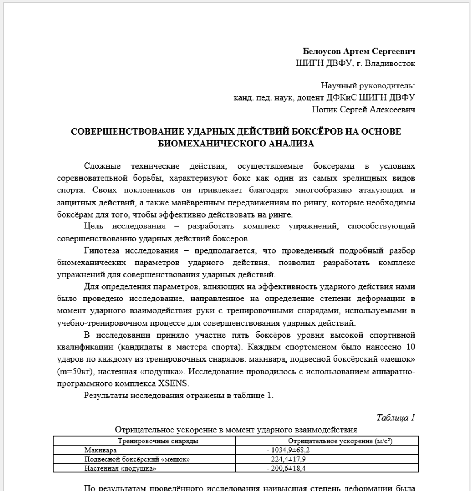
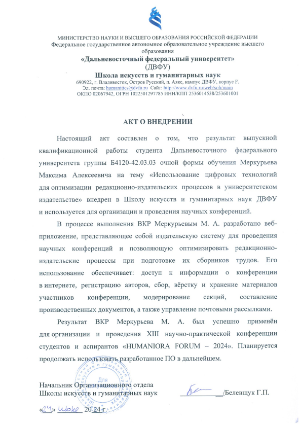

# 📚 Conference Publishing System

[](https://github.com/Bit-Maximum/Conference-Publishing-System/blob/main/README.md)
[](https://github.com/Bit-Maximum/Conference-Publishing-System/blob/main/translation/README.ru.md)

### 🎓 **Bachelor's Thesis**
**Author:** Maxim Merkurev

**Year of diploma defense:** 2024

---

## 🧩 Project Overview

**Conference Publishing System** is a web platform developed to support the **editorial and publishing process** for academic conference proceedings.

The project was inspired by [Open Journal Systems](https://pkp.sfu.ca/software/ojs/), but aims to address its shortcomings and adapt it to the actual workflow of academic publishing in universities. To achieve this, **in-depth interviews** were conducted with the management of **[FEFU Publishing House](https://www.dvfu.ru/science/publishing-activities/)**, existing issues were identified, and improvements were implemented.

---

## 🎯 Project Goals

- 📑 Automate the editorial workflow
- 🧠 Optimize typesetting, reviewing, and publishing processes
- 🔁 Improve transparency in author-editor interactions
- ☁️ Integrate with **Yandex Disk** cloud storage and enable backup capabilities

---

## 🧪 Deployment & Usage

The system was successfully used for:
- **13th "HUMANIORA FORUM – 2024" Conference**
- **14th "HUMANIORA FORUM – 2025" Conference**

The project is deployed on the **FEFU School of Arts and Humanities** server.

---

## 🧰 Implemented Features

- ✅ Over **100 responsive pages**
- ✅ **Cloud storage** subsystem for document submission and management
- ✅ Database in **3NF** with **logical replication**
- ✅ Tools for **backup and restore**
- ✅ **Email automation** for notifications
- ✅ Role-based access: admin, section moderator, reviewer, author
- ✅ **Docker** integration
- ✅ **Automatic document formatting module:**:
    - Adjusts fonts, margins, and heading styles
    - Removes prohibited elements and applies conference templates

---

## 🎥 Video Tutorials

▶️ YouTube Playlist:
https://www.youtube.com/playlist?list=PLf6gC1wRM2y6jCYO396PGgVyIYftUHzp8

---

## 🚀 Installation & Setup

### 📦 Requirements

- [Docker](https://docs.docker.com/get-docker/)
- [Docker Compose](https://docs.docker.com/compose/install/)

---

### 🔧 Setup Instructions

1. Clone the repository:

```bash
git clone https://github.com/Bit-Maximum/Conference-Publishing-System.git
cd Conference-Publishing-System
```

2. Configure required environment variables in the `.env` file.
   📄 See [ENVIRONMENT.md](ENVIRONMENT.md) for details.

3. Build and run the containers:
```bash
docker compose up --build -d 
```

4. Collect static files:
```bash
docker exec -it -u 0 django python manage.py collectstatic --no-input 
```

The site will be available at: http://127.0.0.1/

5. 🧪 (Optional) Load demo data:
```bash
docker-compose exec db pg_restore \
  -U ${DB_USER} \
  -d ${DB_NAME} \
  -Fc --clean --if-exists --no-owner \
  --data-only /tmp/demo_database.dump
```
> Replace `${DB_USER}` and `${DB_NAME}` with your values from `.env`. For example:
```bash
docker-compose exec db pg_restore \
  -U dbuser \
  -d dockerdjango \
  -Fc --clean --if-exists --no-owner \
  --data-only /tmp/demo_database.dump
```

### 📥 Default Login Credentials
| Role                 | Email                                   | Password |
| -------------------- | --------------------------------------- | ------ |
| Administrator        | [admin@mail.com](mailto:admin@mail.com) | admin  |
| Section Moderator     | [staff@mail.com](mailto:staff@mail.com) | staff  |
| Conference Participant | [ivan@mail.com](mailto:ivan@mail.com)   | ivan   |

---

## Gallery

https://github.com/user-attachments/assets/ab52a354-54f0-42cc-b3c2-352257d2429a

https://github.com/user-attachments/assets/b277eb29-983e-4288-bf33-bf667247448e

https://github.com/user-attachments/assets/2cb3ef58-aea9-4131-84f9-eb25409068c0

---

## 📄 Autoformatting in Action
The system automatically formats author-submitted documents according to conference requirements:
* Aligns headings
* Normalizes fonts and sizes
* Applies proper spacing
* Removes disallowed elements and incorrect styles
* Applies a consistent formatting template

| Before Formatting                         | After Autoformatting    |
|-------------------------------------------|-----------------------------|
|  |  |
|              |  |
|              |  |

> ⚙️ The formatting module is built with `python-docx` and is triggered automatically when a document is uploaded via the conference interface.

## 📎 Implementation Deed
The result of this project was the official **adoption of the system** by the FEFU School of Arts and Humanities.



## 🤝 Acknowledgments
- To the leadership of **[FEFU Publishing House](https://www.dvfu.ru/science/publishing-activities/)** — for expert feedback
- To FEFU School of Arts and Humanities faculty — for testing the prototype
- To conference participants — for active feedback and suggestions
